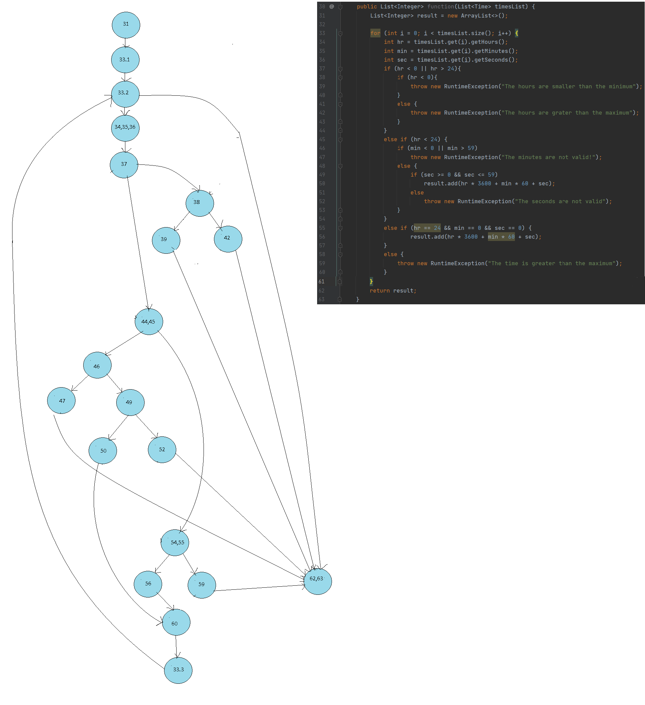

***
- Немам порано работено во .md фајлови па затоа ставив и
обичен .txt фајл, бидејќи не знам дали и кај вас се
прикажува исто како кај мене.

- Исто така имав проблеми со Gradle и верзии, а треба да 
се спремам за колоквиуми па немав време да инсталирам и барам
решенија, па ги напишав само како треба да се синтаксички,
но не ги изтестирав сам.
***
1. CFG според линиите во кодот десно:

2. Цикломатската комплексност на графот е 8.
Ја добив според формулата Е - V + 2, каде
26 - 20 + 2 = 8.

3. Multiple Condition критериум:  
- if (hr < 0 || hr > 24) in #37  
Combinations|Inputs|Branching  
TX|-1,10,34|37-38  
FT|25,10,34|37-38  
FF|13,10,34|37-44  
- if (hr < 0) in #38  
Combinations|Inputs|Branching  
T|-1,10,34|38-39  
F|14,10,34|38-42  
- else if (hr < 24) in #45  
Combinations|Inputs|Branching  
T|12,10,34|45-46  
F|26,10,34|45-54  
- if (min < 0 || min > 59) in #46  
Combinations|Inputs|Branching  
TX|12,-7,34|46-47  
FT|14,61,34|46-47  
FF|12,13,34|46-49  
- if (sec >= 0 && sec <= 59) in #49  
Combinations|Inputs|Branching  
TT|12,13,34|49-50  
TF|12,13,63|49-52  
FX|12,13,-9|49-52  
- else if (hr == 24 && min == 0 && sec == 0) in #55  
Combinations|Inputs|Branching  
TTT|24,0,0|55-56  
TTF|24,0,2|55-59  
TFX|24,3,1|55-59  
FXX|14,0,0|55-59  

Ги гледаме сите комбинации на условите што може да се случат
и за сите нив напишав кој треба да биде инпутот и од која
линија на која ќе премини програмата за сите кондиции соодветно.

4\. Every branch критериум:
Test Cases:  
1.{13,30,40;24,0,0}
2.{25,30,40}
3.{-1,30,40}
4.{13.62,40}
5.{12,40,65}
6.{24,60,60}
|Branch|Test1|Test2|Test3|Test4|Test5|Test6|  

+-> entered  
?-> did not enter  

31 - 33.1|+|+|+|+|+|+|  
33.1 - 33.2|+|+|+|+|+|+|  
33.2 - 62,63|+|?|?|?|?|?|  
33.2 - 34,35,36|+|+|+|+|+|+|  
34,35,36 - 37|+|+|+|+|+|+|  
37 - 38|?|+|+|?|?|?|  
37 - 44,45|+|?|?|+|+|+|  
38 - 39|?|?|+|?|?|?|  
38 - 42|?|+|?|?|?|?| 
39 - 60|?|?|+|?|?|?|
42 - 60|?|+|?|?|?|?|
44,45 - 54,55|+|?|?|?|?|+|  
44,45 - 46|+|?|?|+|+|?|  
46 - 47|?|?|?|+|?|?|  
47 - 60|?|?|?|+|?|?|  
46 - 49|+|?|?|?|+|?|  
49 - 50|+|?|?|?|?|?|  
49 - 52|?|?|?|?|+|?|  
62 - 60|?|?|?|?|+|?|  
50 - 60|+|?|?|?|?|?|  
54,55 - 56|+|?|?|?|?|?|  
54,55 - 58,59|?|?|?|?|?|+|  
58,59 - 60|?|?|?|?|?|+|  
56 - 60|+|?|?|?|?|?|  
60 - 33.3|+|?|?|?|?|?|  
33.3 - 33.2|+|?|?|?|?|?|  

Минималниот број на тестови за да се помине целиот код се 6.
Првиот е успешниот со коректни инпути, а другите се со
грешни часови, минути, секунди или пак го надминуваат максималното 
време. Има 6 тестови и 6 вкупно прегради (|+| или |-|), кои
опишуваат кои од тестовите од 1-6 ја посетиле линијата.

5\.Како што објаснив погоре за критериумот со Every Branch
направив 6 тестови:
Првиот со валидни времиња за да исполни два ифови
Вториот и третиот со невалидни часови
Четвртиот со невалидни минути
Петтиот со невалидни секунди
Шестиот со поголем вкупен број на секунди во 1 ден.

